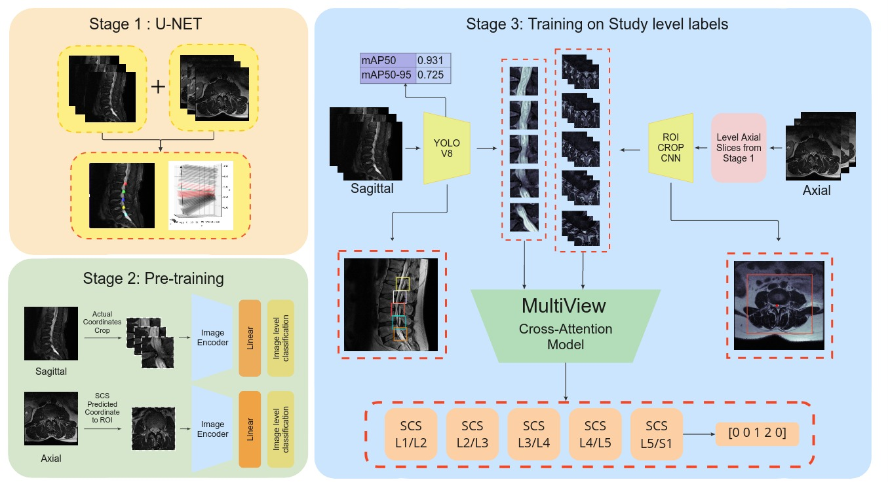
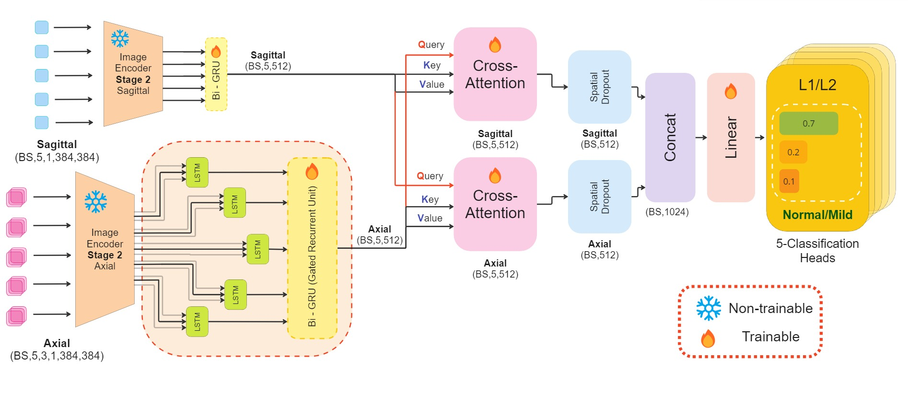
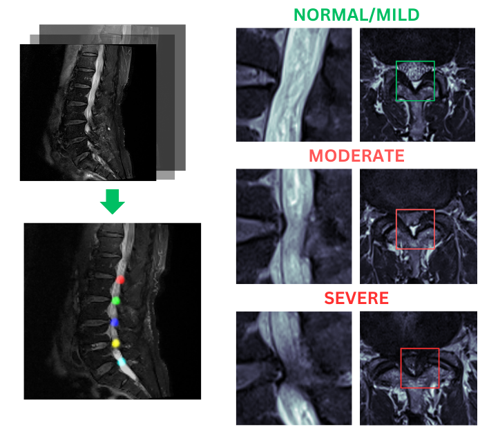

# M-SCAN: A Multistage Framework for Lumbar Spinal Canal Stenosis Grading Using Multi-View Cross Attention

**Authors:** Arnesh Batra, Arush Gumber, Anushk Kumar  
**Accepted at CVPR 2025 Demo Track**

**[Live Web Application](https://mscan.vercel.app/)** | [**Conference Presentation**](https://youtu.be/bVLlfGIOBiI) | [**Technical Demo**](https://www.youtube.com/watch?v=M1XFXeJkU1g) | [**Research Paper**](https://arxiv.org/abs/2503.01634)

---

## Overview

M-SCAN is a deep learning framework for fully automated grading of lumbar spinal canal stenosis (SCS) from MRI scans. It achieves state-of-the-art performance with an AUROC of 0.971 and 93.8% accuracy on a diverse clinical dataset. M-SCAN addresses the growing diagnostic burden on radiologists by combining sagittal and axial MRI views through a robust multi-stage and multi-view cross-attention architecture, ensuring accurate, interpretable, and efficient clinical decision support.

---

## Key Features

- **Three-Stage Architecture**:
  - **Stage 1**: U-Net based vertebrae detection on sagittal MRI slices
  - **Stage 2**: Pre-training CNN models on cropped sagittal and axial images using image-level labels
  - **Stage 3**: Multi-view cross-attention classification with 5 output heads (L1/L2 to L5/S1)

- **Cross-Modal Modeling**:
  - Bidirectional GRU and LSTM for sequence-level modeling across varying slice counts
  - Cross-attention mechanism for fusing sagittal and axial feature representations

- **Clinical Capabilities**:
  - End-to-end DICOM to diagnosis pipeline with zero preprocessing
  - Generates confidence scores, bounding boxes, and spinal level-specific severity predictions
  - Reduces expert reading time from 30–45 minutes to under 2 minutes

---

## Architecture




```

DICOM Input
↓
Vertebrae Detection (YOLOv8)
↓
Keypoint Localization (PointNet)
↓
Sagittal + Axial Crop Extraction
↓
Image-Level Classification (EfficientNetV2)
↓
Custom Sequential Cross-Attention Architecture(see diagramme)
↓
Level-Wise Severity Grading (L1/L2 through L5/S1)

````

---

## Performance

| Model                             | Accuracy | AUROC |
|----------------------------------|----------|-------|
| CNN (Sagittal only) + Concat     | 89.82%   | 0.851 |
| CNN (Sagittal only) + GRU        | 91.37%   | 0.863 |
| CNN (Multi-View) + GRU           | 92.60%   | 0.891 |
| **M-SCAN (Ours)**                | **93.80%** | **0.971** |

---

## Dataset

The RSNA 2024 Lumbar Spine Degenerative Dataset was used, comprising 1,975 MRI studies labeled with stenosis grades across five intervertebral disc levels:
- **L1/L2**, **L2/L3**, **L3/L4**, **L4/L5**, **L5/S1**
- MRI Types: **Axial T2**, **Sagittal T1**, **Sagittal T2/STIR**
- Classes: **Normal/Mild**, **Moderate**, **Severe**

This dataset includes real-world variances in image resolution, machine type, and histogram distributions.

---

## Web Application

A live clinical simulation of M-SCAN is deployed at [https://mscan.vercel.app/](https://mscan.vercel.app/), enabling:

- DICOM ZIP upload and automated processing
- Vertebrae detection with bounding boxes
- Stenosis grading with confidence scores
- Visual walkthroughs and level-wise grading reports
- No manual preprocessing or configuration required



---

## Installation

Clone the repository and install the required dependencies:

```bash
git clone https://github.com/ArushGumber/rsna_mscan.git
cd rsna_mscan
pip install -r requirements.txt
````

---

## Usage

### Run Gradio Web Interface:

```bash
python gradio_app.py
```

### Run Batch Processing Pipeline:

```bash
python main_pipeline.py --study_id <study_id> --root_folder <path_to_dicom_folder>
```

---

## Model Components

* **Vertebrae Detection**: YOLOv8 models trained on sagittal T1 and T2 images
* **Keypoint Localization**: PointNet for localizing vertebral levels
* **Stenosis Classification**: EfficientNetV2 with attention-enhanced CNN heads
* **Sequence Modeling**: Bidirectional GRU and LSTM networks for context-aware predictions
* **Cross-Attention**: Multi-view fusion to align and merge sagittal and axial representations

---

## Citation

If you use this work in your research or applications, please cite:

```bibtex
@article{batra2025mscan,
  title={M-SCAN: A Multistage Framework for Lumbar Spinal Canal Stenosis Grading Using Multi-View Cross Attention},
  author={Batra, Arnesh and Gumber, Arush and Kumar, Anushk},
  journal={arXiv preprint arXiv:2503.01634},
  year={2025}
}
```

---

## License

This repository is licensed under the MIT License. See the `LICENSE` file for more information.

---

## Contact

For questions, collaborations, or academic inquiries:

* **Arnesh Batra** — [arnesh23129@iiitd.ac.in](mailto:arnesh23129@iiitd.ac.in)
* **Arush Gumber** — [arush23136@iiitd.ac.in](mailto:arush23136@iiitd.ac.in)
* **Anushk Kumar** — [anushk23115@iiitd.ac.in](mailto:anushk23115@iiitd.ac.in)

```
